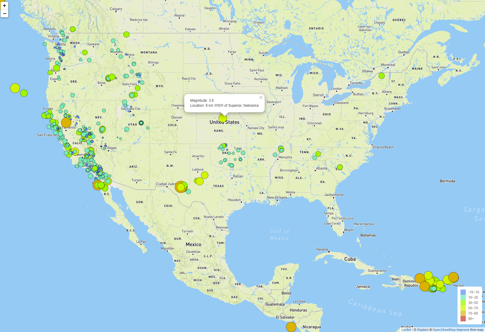
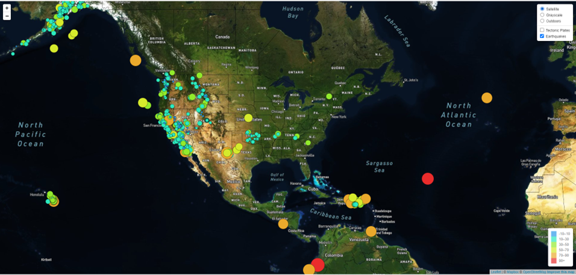

# leaflet-challenge
##### Created by: Estela Perez
## Background
The purpose of this project was make vizualizations from earthquake data collected for the past 7 days from https://earthquake.usgs.gov/earthquakes/feed/v1.0/geojson.php

### Part 1:
* Using Leaflet, created a map that plots all the earthquakes from your dataset based on their longitude and latitude.
* Added data markers that reflect the magnitude of the earthquake by their size and the depth of the earthquake by color. Earthquakes with higher magnitudes appear larger, and earthquakes with greater depth appear darker in color.
* Included popups that provide additional information about the earthquake when its associated marker is clicked.
* Created a legend that provides context for the map data.

### Part 2:
* Plotted the tectonic plates dataset on the map in addition to the earthquakes
* Added other base maps to choose from
* Put each dataset into separate overlays that can be turned on and off independently
* Added layer controls to our map

